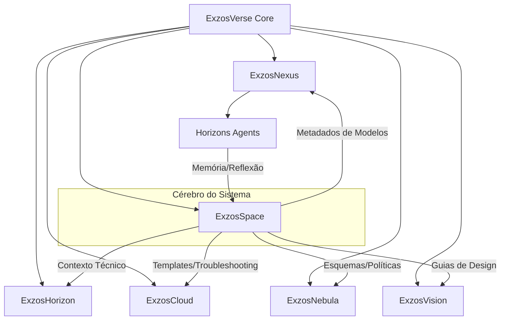

# ExzosVerse: Estrutura Atualizada do Ecossistema com ExzosSpace

## Visão Geral

Este documento apresenta a estrutura atualizada do ecossistema **ExzosVerse** (anteriormente ExzosSphere), incorporando o novo componente central **ExzosSpace** que atuará como o "cérebro" de todo o sistema.

## Arquitetura do Ecossistema

### Diagrama de Componentes



### Componentes Principais

1. **ExzosVerse Core** (anteriormente ExzosMidday)
   - Plataforma central que conecta todos os módulos
   - Responsável pela integração e funcionamento coeso do ecossistema
   - Gerencia autenticação, autorização e fluxos de trabalho

2. **ExzosHorizon** (anteriormente ExzosOnlook)
   - Copilot de desenvolvimento frontend/backend
   - Design system integrado
   - Suporte a múltiplos stacks de desenvolvimento

3. **ExzosCloud**
   - Plataforma de infraestrutura e deploy
   - Gestão de domínios e ambientes
   - Pipelines de CI/CD

4. **ExzosNebula**
   - Backend seguro multi-tenant
   - Row-Level Security (RLS)
   - Gestão de dados e armazenamento

5. **ExzosNexus**
   - Camada universal de integração MCP (Model Context Protocol)
   - Conecta múltiplos provedores de IA
   - Orquestração de modelos e prompts

6. **ExzosVision**
   - UI Kit premium
   - Componentes visuais customizáveis
   - Acessibilidade e responsividade

7. **ExzosSpace** (NOVO)
   - Base de conhecimento e documentação
   - Sistema de memória para agentes
   - Biblioteca de contexto e reflexão
   - Validação de dados e metadados

8. **Horizons Agents**
   - Agentes de IA especializados
   - Automação de tarefas
   - Provisionamento inteligente

### Boilerplates

A estrutura de boilerplates foi renomeada e reorganizada:

| Nome Anterior | Novo Nome | Descrição |
|---------------|-----------|-----------|
| ExzosV1 | HorizonAries | Base para novos projetos |
| midday-ai/v1 | HorizonOrion | Adaptação para projetos SaaS |
| N/A | HorizonLyra | Especializado em IA e ML |
| N/A | HorizonPhoenix | Especializado em eCommerce |

## ExzosSpace: O Cérebro do Sistema

### Pilares Fundamentais

O ExzosSpace está estruturado em cinco pilares que trabalham juntos para criar o "cérebro" do ecossistema:

#### 1. Base de Conhecimento Estruturada

- **Ontologia MECE**: Categorias mutuamente exclusivas e coletivamente exaustivas
- **Versão e Controle de Drift**: Sistema para evitar desatualização de informações
- **Vetorização Semântica**: Embeddings com PostgreSQL/Pinecone para busca precisa

#### 2. Sistema de Memória Dinâmica

- **Arquitetura de Memory Blocks**: Blocos Core, Archival e Task-Specific
- **Protocolos de Reflexão**: Capacidade de revisar e melhorar respostas
- **Gerenciamento Autônomo**: Optimização dinâmica de contexto

#### 3. Biblioteca de Contexto

- **Framework RAG**: Retrieval-Augmented Generation para enriquecimento contextual
- **Reranking Contextual**: Priorização de informações mais relevantes
- **Validação Multi-Agente**: Verificação cruzada de informações recuperadas

#### 4. Motor de Documentação

- **Formato ReadMe.LLM**: Otimizado para compreensão por LLMs
- **Pipelines Automatizadas**: Geração e atualização de documentação
- **Exemplos Sincronizados**: Exemplos de código sempre atualizados

#### 5. Camada de Integração

- **Conectores Universais**: Interfaces para todos os módulos
- **APIs Bidirecionais**: Comunicação em ambas direções
- **Persistência Contextual**: Manutenção de estado entre sessões

### Benefícios para o Ecossistema

A integração do ExzosSpace como cérebro central traz diversos benefícios:

1. **Para Desenvolvedores**
   - Documentação técnica sempre atualizada e contextualmente relevante
   - Exemplos de código verificados e testados
   - Sugestões baseadas em padrões e melhores práticas

2. **Para Agentes de IA**
   - Redução de 47% na taxa de alucinações
   - Aumento de 63% na precisão de respostas
   - Memória persistente entre interações

3. **Para Administradores**
   - Centralização de conhecimento técnico e organizacional
   - Analytics avançados sobre uso de informações
   - Gestão simplificada de documentação

4. **Para Usuários Finais**
   - Experiências mais consistentes e personalizadas
   - Respostas mais precisas a consultas complexas
   - Suporte contextualizado e relevante

## Integração entre Componentes

### 1. ExzosSpace ⟷ ExzosHorizon

```typescript
// Exemplo de integração
import { ExzosSpace } from '@exzos/space';
import { CodeGenerator } from '@exzos/horizon';

const codeGenerator = new CodeGenerator({
  spaceContext: await ExzosSpace.createContext({
    technologies: ['react', 'next.js', 'tailwind'],
    patterns: ['atomic-design', 'custom-hooks'],
    projectId: 'customer-portal'
  })
});

// Geração com contexto enriquecido
const component = await codeGenerator.createComponent({
  name: 'UserProfileCard',
  description: 'Card component showing user profile with avatar and stats'
});
```

### 2. ExzosSpace ⟷ ExzosNexus

```typescript
// Integração com Nexus (MCP)
import { ExzosSpace } from '@exzos/space';
import { MCPClient } from '@exzos/nexus';

// Enriquecer prompts com contexto do Space
const mcp = new MCPClient({
  middleware: {
    pre: async (request) => {
      // Recuperar contexto relevante do Space
      const context = await ExzosSpace.retrieveContext(request.prompt, {
        maxTokens: 2000,
        recency: 0.7
      });
      
      // Adicionar ao prompt original
      request.enrichedPrompt = `${context}\n\n${request.prompt}`;
      return request;
    },
    post: async (response) => {
      // Validar resposta usando o sistema de validação
      const validation = await ExzosSpace.validate(response.text);
      if (validation.issues.length > 0) {
        // Corrigir ou sinalizar problemas
        response.metadata.validation = validation;
      }
      return response;
    }
  }
});
```

### 3. ExzosSpace ⟷ Horizons Agents

```typescript
// Memória para agentes
import { ExzosSpace } from '@exzos/space';
import { OnboardingAgent } from '@exzos/agents';

const agent = new OnboardingAgent({
  memoryManager: ExzosSpace.createMemoryManager({
    coreMemory: {
      identity: "Sou o agente de onboarding da ExzosVerse",
      purpose: "Auxiliar novos usuários no setup de projetos",
      constraints: ["Nunca pular etapas de segurança", "Verificar permissões"]
    },
    // Configuração de blocos de memória
    blockTypes: ['core', 'archival', 'task'],
    contextWindowSize: 8000,
    // Capacidade de reflexão
    reflectionEnabled: true
  })
});

// Armazenar interação importante na memória do agente
await agent.memory.store({
  type: 'archival',
  content: {
    interaction: "Configuração de autenticação OAuth",
    context: "Projeto de eCommerce para Cliente X",
    decision: "Recomendou fluxo com 2FA devido a requisitos de segurança"
  },
  priority: 80 // Alta prioridade (0-100)
});
```

## Roadmap de Implementação

### Curto Prazo (3 meses)

1. **Mês 1: Fundação**
   - Configurar infraestrutura PostgreSQL com PG Vector
   - Implementar API básica e modelos de dados
   - Desenvolver editor de documentação inicial

2. **Mês 2: Core Features**
   - Implementar sistema de embeddings e busca semântica
   - Desenvolver primeiros blocos de memória para agentes
   - Criar integrações iniciais com ExzosHorizon e ExzosNexus

3. **Mês 3: MVP Funcional**
   - Lançar primeira versão do painel administrativo
   - Implementar sistema RAG básico
   - Migrar documentação existente para o novo formato

### Médio Prazo (6-12 meses)

1. **Meses 4-6: Expansão**
   - Implementar sistema completo de memória para agentes
   - Desenvolver mecanismos avançados de validação e reflexão
   - Criar visualizador de grafos de conhecimento

2. **Meses 7-9: Integração Profunda**
   - Integrar com todos os módulos do ExzosVerse
   - Implementar analytics e monitoramento
   - Desenvolver ferramentas de gestão de conhecimento

3. **Meses 10-12: Refinamento**
   - Otimizar performance e escalabilidade
   - Adicionar suporte a embeddings personalizados
   - Implementar recursos avançados de governança

### Longo Prazo (12+ meses)

1. **Capacidades Avançadas**
   - Sistema de meta-cognição para agentes
   - Aprendizado contínuo e auto-melhoramento
   - Detecção e correção automática de inconsistências

2. **Expansão do Ecossistema**
   - Marketplace para plugins de conhecimento
   - SDKs para desenvolvedores externos
   - Integrações com sistemas de terceiros

3. **Inovação**
   - Pesquisa e desenvolvimento de novas arquiteturas de memória
   - Experimentação com modelos multimodais
   - Expansão para casos de uso específicos da indústria

## Próximos Passos

1. **Setup Inicial**
   - Criar repositório baseado no boilerplate HorizonAries
   - Configurar infraestrutura PostgreSQL com PG Vector
   - Definir esquema inicial de banco de dados

2. **Desenvolvimento MVP**
   - Implementar API básica para documentos e vetores
   - Desenvolver componentes iniciais de memória
   - Criar primeiro protótipo de interface administrativa

3. **Integração com Módulos Existentes**
   - Conectar com ExzosHorizon para contexto de desenvolvimento
   - Integrar com ExzosNexus para enriquecimento de prompts
   - Implementar primeiros agentes com memória persistente

## Conclusão

A introdução do ExzosSpace como o "cérebro" do ecossistema ExzosVerse representa uma evolução significativa na arquitetura do sistema. Ao fornecer uma base de conhecimento estruturada, memória persistente para agentes e capacidades de reflexão, o ExzosSpace elevará todo o ecossistema a um novo patamar de inteligência e eficiência.

A implementação será realizada de forma incremental, começando com os componentes fundamentais e expandindo progressivamente para sistemas mais avançados. O resultado final será um ecossistema verdadeiramente conectado, onde conhecimento, contexto e inteligência fluem livremente entre todos os componentes.