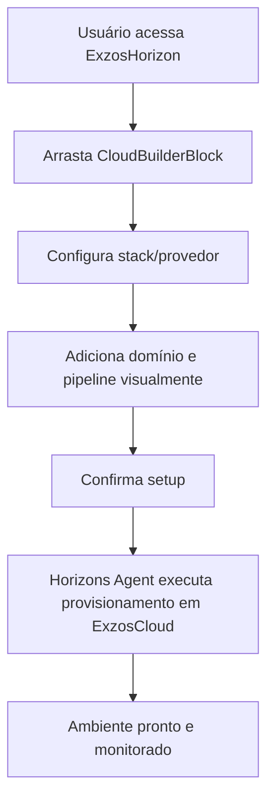

# Guia de Integração — ExzosCloud no ExzosHorizon & Horizons Agents

---

## Objetivo

Permitir que a estrutura digital do **ExzosCloud** seja criada, provisionada e gerida diretamente pela interface visual e agentes do **ExzosHorizon**.  
Usuários poderão criar ambientes cloud, domínios, pipelines e automações via builder visual (no-code/low-code) e comandos inteligentes, acelerando o setup e a produtividade.

---

## 1. Estrutura Digital do ExzosCloud via ExzosHorizon

### a) Componentes Visuais

- **CloudBuilderBlock:**  
  Componente drag-and-drop para iniciar ambientes cloud, escolher provider (Vercel, Railway, Coolify, etc), configurar stack e variáveis.
- **DomainManagerWidget:**  
  Componente para conectar, registrar, configurar e monitorar domínios e DNS.
- **PipelineVisualizer:**  
  Canvas visual para montar pipelines CI/CD, deploy, rollback, staging, preview e integrações.
- **ResourcePanel:**  
  Painel de recursos para visualizar, adicionar e remover bancos, storage, funcoes serverless, monitoring, etc.
- **AgentCommandBar:**  
  Barra de comandos para interagir com Horizons Agents via prompt ou ações rápidas (ex: “Provisionar deploy Node.js na Railway”, “Adicionar domínio customizado”).

---

### b) Fluxo Visual

1. **Acesse o ExzosHorizon Builder**
2. **Arraste o CloudBuilderBlock para o canvas**
3. **Escolha stack/provedor (ex: Next.js + Vercel)**
4. **Configure variáveis/envs no ResourcePanel**
5. **Adicione DomainManagerWidget para gerenciar domínios**
6. **Monte pipelines CI/CD visualmente com PipelineVisualizer**
7. **Confirme — Horizons Agent provisiona e integra tudo automaticamente**
8. **Monitore/automatize com AgentCommandBar (ex: “Automatize backup diário”)**

---

## 2. Horizons Agents — Orquestração Inteligente

### a) Funções dos Agents

- **Auto-provisionamento:**  
  Quando um usuário monta a estrutura visual, o agent executa todas as integrações, APIs e deploys necessários automaticamente.
- **Sugestão & Correção:**  
  Agents sugerem configurações, detectam erros e propõem otimizações (“Recomendo ativar autoscaling para esta stack”).
- **Automação de Fluxos:**  
  Agents criam rotinas de deploy, backups, alertas, escalonamento e integrações entre ExzosCloud, Nebula, Vision, Nexus, etc.
- **Documentação & Auditoria:**  
  Agents geram documentação automática do ambiente criado e mantêm logs de provisionamento.

### b) Comandos Exemplos para Agents

- “Provisionar cloud Next.js na Railway e conectar domínio exzos.app”
- “Gerar pipeline de deploy com rollback automático”
- “Adicionar storage PostgreSQL e backup diário”
- “Integrar com monitoramento e alertas via Telegram”

---

## 3. Exemplo de Fluxo Prático

---

## 4. Boas Práticas & Regras

- Sempre use componentes visuais validados e atualizados do ExzosVision.
- Orquestração só ocorre após revisão visual e confirmação do usuário.
- Agents devem registrar todas as ações e sugestões para rastreabilidade.
- Permita undo/redo de cada etapa de provisionamento.
- Integração profunda: ExzosCloud, Nebula, Vision, Nexus, Admin sempre disponíveis para agentes e UI.
- Segurança: toda ação é validada por permissões do usuário/org.

---

## 5. Roadmap Futuro

- Geração automática de templates de infraestrutura via IA.
- Marketplace de “Blueprints” de ambientes prontos (ex: SaaS completo com CI/CD, domínio, storage, monitoring, deploy multi-cloud).
- Suporte a scripts customizados e deploys serverless edge.
- Integração de billing, uso e métricas.

---

## Links Úteis

- [ExzosCloud](https://github.com/exzosdigital/exzoscloud)
- [ExzosHorizon](https://github.com/exzosdigital/exzoshorizon)
- [ExzosVision UI Kit](https://github.com/exzosdigital/exzosvision)
- [Horizons Agents](https://github.com/exzosdigital/exzoshorizon-agents)

---

> **Resumo:**  
O ExzosCloud pode ser totalmente provisionado e gerido de forma visual e inteligente dentro do ExzosHorizon, usando componentes UI e Horizons Agents, unificando design, automação e infraestrutura em um só fluxo.