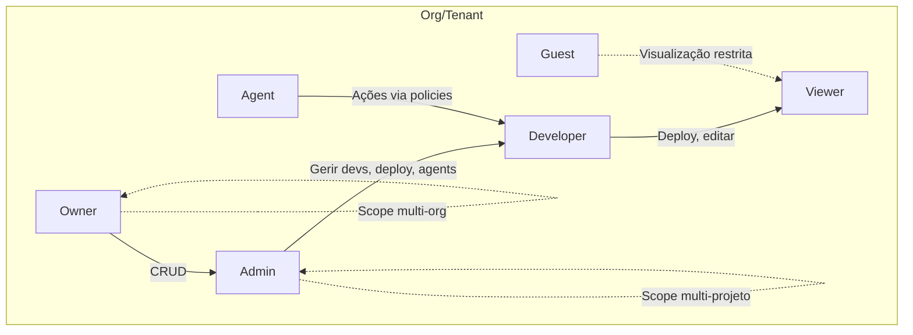

# Guia de Segurança & Permissões — ExzosVerse

---

## Introdução

Este guia abrange as políticas de segurança, controle de acesso (roles), multi-tenancy e melhores práticas para proteger usuários, organizações e dados em todo o ecossistema ExzosVerse (Cloud, Vision, Nebula, Horizon, Nexus, Agents).

---

## 1. Modelo de Permissões (RBAC + ABAC)

- **RBAC (Role-Based Access Control):**  
  Controle de acesso baseado em papéis. Exemplo: admin, owner, developer, agent, viewer.
- **ABAC (Attribute-Based Access Control):**  
  Políticas refinadas usando atributos (org, tenant, projeto, status, time, etc).
- **RLS (Row-Level Security):**  
  Aplicado ao ExzosNebula (banco), garante que cada usuário/tenant só veja seus próprios dados.

---

## 2. Papéis (Roles) Globais

| Papel        | Descrição                                         | Permissões principais                                        |
|--------------|---------------------------------------------------|--------------------------------------------------------------|
| Owner        | Dono do workspace/org                             | Tudo (CRUD, billing, configs, admin)                         |
| Admin        | Administração de projetos/org                     | Gerir usuários, ambientes, deploy, integrações               |
| Developer    | Desenvolvimento e deploy                          | Deploy, editar recursos, acessar logs, configs limitadas     |
| Viewer       | Somente leitura                                   | Visualizar recursos, logs, status                            |
| Agent        | Agente IA/Automação                               | Executar comandos limitados por policies                     |
| Guest        | Usuário externo temporário (ex: cliente demo)     | Visualização controlada, sem acesso a configs sensíveis      |

> **Obs:** Papéis podem ser definidos por organização, projeto, tenant e herdados ou sobrescritos localmente.

---

## 3. Multi-Tenancy

- Cada tenant/org possui isolamento total de dados no backend (RLS), ambientes cloud, domínios e configurações.
- Usuários podem pertencer a múltiplos tenants/orgs, com papéis diferentes em cada contexto.
- Agents operam sempre em nome de um tenant/org e nunca podem escapar do escopo atribuído.

---

## 4. Políticas de Permissão (Exemplos)

### a) ExzosCloud

- Somente Owner/Admin pode criar/deletar ambientes e domínios.
- Developer pode fazer deploy, rollback e ver logs.
- Viewer pode ver status, mas não alterar nada.

### b) ExzosVision/Horizon

- Admin pode criar e editar templates/projetos.
- Developer pode editar componentes, mas não remover projetos globais.
- Viewer pode só visualizar layouts e componentes.

### c) ExzosNebula

- RLS ativa por padrão; cada SELECT/UPDATE/DELETE é filtrado por tenant_id/org_id.
- Funções sensíveis exigem permissão explícita (ex: exportar dados, alterar policies).

### d) ExzosNexus & Agents

- Agents só podem executar comandos que o papel do usuário permite.
- Toda ação de agent é auditada e rastreada (logs).
- Integração de agents externos requer aprovação de admin/owner.

---

## 5. Mapa Visual de Acesso (Access Policy Map)



---

## 6. Exemplos Práticos de Configuração

### Exemplo 1: Adicionando um usuário como Developer apenas em um projeto

```json
{
  "user_id": "abc123",
  "org_id": "org567",
  "project_id": "prj999",
  "role": "developer"
}
```

### Exemplo 2: Policy de Agent para Deploy

```json
{
  "agent_id": "agent007",
  "allowed_actions": ["deploy", "rollback"],
  "context": {
    "org_id": "org567",
    "project_id": "prj999"
  }
}
```

### Exemplo 3: Row-Level Security no Nebula

```sql
-- Exemplo de policy para SELECT apenas do tenant atual
CREATE POLICY select_own_rows ON users
FOR SELECT USING (tenant_id = current_setting('app.tenant_id')::uuid);
```

---

## 7. Melhores Práticas

- Sempre use RLS no banco.
- Audite todas as ações sensíveis (criação/deleção de ambientes, deploy, alteração de roles, uso de agents).
- Revise permissões periodicamente.
- Use autenticação forte (OAuth, SSO, 2FA).
- Integre logs de auditoria com monitoramento e alertas.

---

## 8. Referências

- [RBAC Design](https://docs.microsoft.com/en-us/azure/role-based-access-control/overview)
- [Row Level Security no PostgreSQL](https://www.postgresql.org/docs/current/ddl-rowsecurity.html)
- [OWASP Security Cheat Sheet](https://cheatsheetseries.owasp.org/)

---

> **Resumo:**  
O sistema de segurança do ExzosVerse é baseado em RBAC+ABAC, multi-tenancy isolado, RLS, auditoria e fluxos claros para agentes, garantindo flexibilidade, controle e proteção em todo o ecossistema.